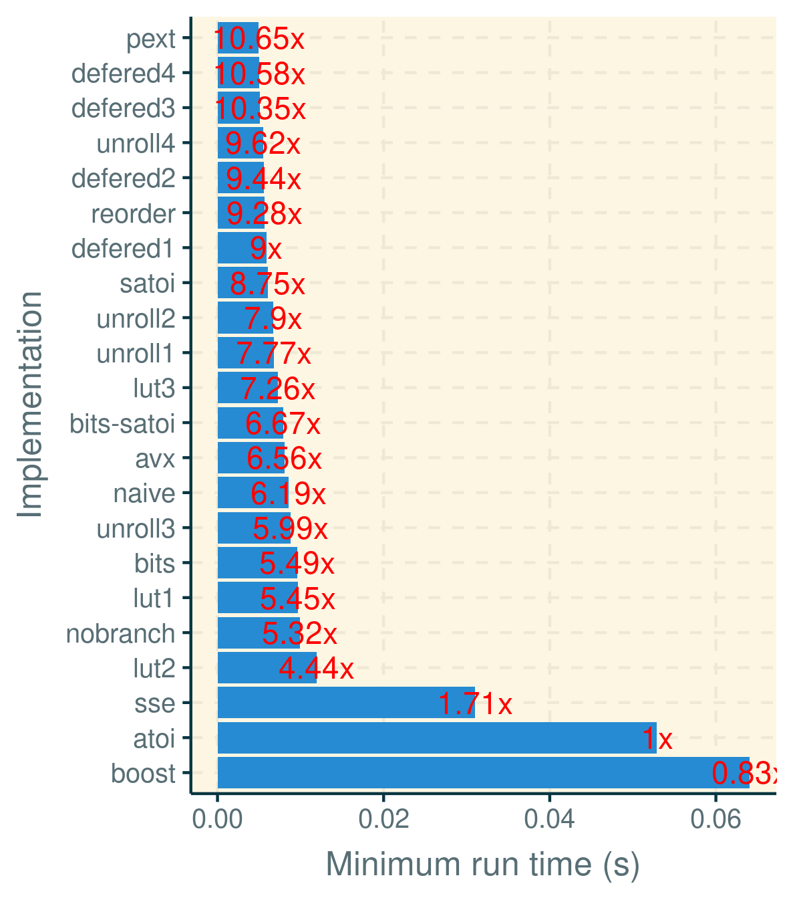
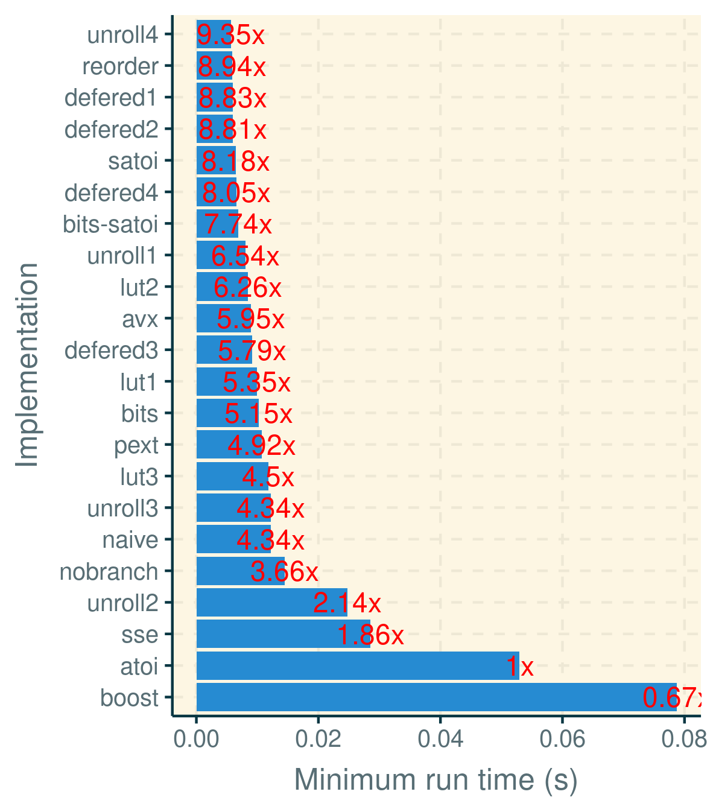
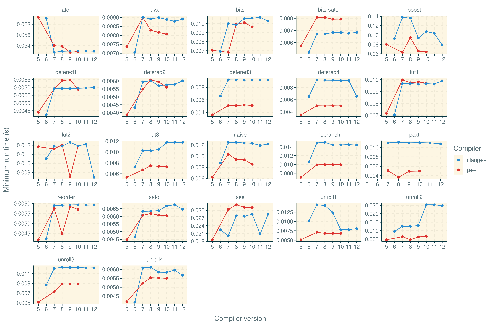

# Micro-optimization exercise

## Goal

This repository summarizes the code and results of a class exercise in micro-optimization.
The goal of this exercise was to optimize the conversion of an array of strings to integers, as expressed in this code excerpt:

```C
void convert_all(unsigned nlines, char *lines[], quote_t nums[])
{
    for (unsigned i = 0; i < nlines; i++) {
        nums[i] = atoi(lines[i]);
    }
}
```

A driver was provided that loaded up an input file of stock quote prices (in cents), and repeatedly called the convert_all function, each time checking that the numbers were converted correctly. It also kept track of the minimum time it took to run all conversions, and reported it at the end of the run. The goal was to replace convert_all with the fastest possible version that works correctly on the given inputs.

## Preliminaries

This repository inclues the driver code (`driver.c`), sample input data file (`quotes.txt`), and all the different implementations in `.cc` files (repeated implementations with the same idea from different people aren't reproduced).

To build, run `bash compile.sh`

To run, pick any implementation binary, say `naive`, and run: `./naive quotes.txt 2000`.

The default `atoi()` implementation is already quite fast, as this library function has been optimized over many years. But it does have two disadvantages: it is not inlined, costing some overhead with every call, and it carefully checks its input string for invalid inputs and negative values, which we can ignore (we just assume all inputs are correct). In addition, it does not take advantage two very specific properties of this workload:
* No inputs are shorter than 3 bytes (100 cents) or longer than 5 bytes (representing $999.99).
* Over 90% of inputs are exactly 4 bytes longs.

Most of the various implementations described next try to exploit one or more of these properties.

## Implementations

Next, I'll describe all the implementations (written by students or myself), and what they try to accomplish, and whether it worked or not.
Note that all filenames end in .cc, but most are actually plain C files. Only a few incorporate C++ featuers.

### Boost

This version simply calls Boost library's lexical_cast template function, which is very generic, but not very optimized for this case. (`boost.cc`)

### Vectorized

One version (`sse.cc`), which I adapted from an implementation from an [online forum](http://www.mersenneforum.org/showthread.php?t=11590), verctorizes the conversion using 128-bit SSE instructions. It first has to justify the input string to the right, however, which takes too long compared to the other implementations. Another implementation (`avx.cc`), by a student, uses AVX2 instructions instead, but is still not as fast as plain scalar code.

### Lookup table 1

This version (`lut1.cc`) is based on an [open-source implementation I wrote for Facebook](https://github.com/facebook/folly/blob/master/folly/Conv.cpp). It converts up to four digits at a time by looking up each digit in an array of 256 entries. 10 of those entries (corresponding to '0' through '9') map to an actual value, and the rest to error values. The looked-up values are then added to create the right sum.
    Another trick this version relies on is the assumption that all strings are contiguous in the input `lines` array, making computation of strlen trivial.

### Lookup table 2

This version (`lut2.cc`) is another attempt at pre-computing some results. It maps all 4 digit numbers into a static array with precomputed results for that string. The mapping is done by mashing together the only 16 significant bits out of the 4 bytes into a 2-byte array index. For numbers of other lengths, it simply calls atoi()--this can easily be improved by using one of the faster versions described here, but only affects ~10% of the inputs.

### Lookup table 3

This version (`lut3.cc`) converts two bytes at a time by precomputing the mapping from all two-digit strings to the corresponding number between 0 and 99. To make the table even smaller, it uses only 12 bits (not 16) for an index, since the top nibble of every digit byte is constant. Because this table is very compact, it fits  nicely in the CPU cache. In fact, we can create two such tables, one for the top two bytes, and one for the bottom two bytes (for 4-and 5-digit numbers), with the former pre-multipled by 100.

### Naive

This version(`naive.cc`) is so intuitive that most people came up with it on their own. It looks something like this:
```C
quote_t convert(char *str)
{ 
  quote_t ret = 0;
  while (*str) {
    ret = ret * 10 + *str - '0';
    str++;
  }
  return ret;
}

```
This works for all string lengths and works surprisingly fast. The reason is that the compiler can stuff the content of the main conversion line (`ret = ret * 10 + *str - '0';`) into just two LEA instructions:
```asm
leal    (%rax,%rax,4), %eax
addq    $1, %rdi
leal    -48(%rdx,%rax,2), %eax

```
These lines first multiply ret by 5, then multiply it by 2 and substract 48 ('0'), and on modern pipelined processors are very fast to run. This version is about 6x faster than `atoi()`.

### Bit ops

This version (`bits.cc`) uses the same naive implementation, but replaces the arithmetic operations of multiplication and substraction with bit shifts and masking. In principle, this should not work, as most compilers are smart enough to pick the best micro-implementation (and consequently, makes things worse sometimes). But it was was able to squeeze a bit more performance out of it by moving the first operation outside of the loop.

### Unrolled

This version (`unroll1.cc`) uses a single loop with a bounded number of iterations, which the optimizer can sometimes completely unroll on its own (not always, however). There's a slightly faster (and more complicated) version in `unroll2.cc` that improves performance by pipelining operations better. A different take on unrolling (`unroll3.cc`) unrolls the convert_all loop instead of the one in convert. Yet another version by a student (`unroll4.cc`) takes this idea to an extreme by unrolling both the convert and convert_all loop together into many small instructions, giving the compiler ample opportunity to reorder instructions and increase instruction-level parallelism.


### Shortcut atoi

This version (`satoi.cc`) improves the naive version, by explicitly unrolling the loop for 3 cases only and eliminating the loop overhead. It starts by computing the first three digits (which are always defined for this input), then computes up to two more digits as needed. A student implemented a similar idea in `bits-satoi.cc`.
Unlike many of the methods till now (including Naive), this version is no longer general enough to work on any length number. It only works on 3-, 4-, and 5-digit strings (as do `lut2.cc` and `lut3.cc`). This is a shortcut assumption that is made explicity for this given stock-quote workload or similar bounded workloads. For other workloads (or after inflation hits), we'd have to add an expensive test.

### Reordered satoi

This version (`reorder.cc`) adds two small but measurable improvements to `satoi.cc`: forcing the initial 3-digit value to be computed with the `lea` trick mentioned in Naive, and reordering the branches so that the most common cases are eliminated first.

### Bit-gather-based lookup

This version (`pext.cc`) is nearly identical to lut2.cc, except it uses the `_pext_u32` intrinsic to quickly compute a 16-bit index out of a 4-byte numeric string. It also incorporates the unrolling technique.

### Defered zeros

This version (`defered1.cc`) by a student cleverly defers the substraction of the '0' characters from the digits till after the conversion has been done, and then takes care of it in a single substraction. It also uses GCC's intrisinc to help the compiler anticipate which branches are more likely than others. In my experiments, these hints do nothing to help, because the CPU can predict branches quite accurately, but usually don't hurt either.

### Reordered defered zeros

This version (`defered2.cc`) Combines the unified substraction trick from `defered1.cc` with the early-termination branch reordering from `reoder.cc` to produce the fastest implementation in this set. The complete conversion function looks like this:

```C
inline quote_t convert(const char *str)
{
  static const quote_t zero = '0';
  static const quote_t fix_3d = 111 * zero;
  static const quote_t fix_4d = 1111 * zero;
  static const quote_t fix_5d = 11111 * zero;

  quote_t ret = str[2] + str[1] * 10 + str[0] * 100;

  if (str[4] == '\0') { // Most likely outcome first:
    ret = ret * 10 + str[3];
    return ret - fix_4d;
  }

  if (str[3] != '\0') {  // Second most-likely case:
    ret = ret * 10 + str[3];
    ret = ret * 10 + str[4];
    return ret - fix_5d;
  }

  return ret - fix_3d;
}
```

### Unrolled reordered defered zeros

This version (`defered3.cc`) improves on defered2 by unrolling the outer loop, the one in the `convert_all` function (basically combining `defered2.cc` with `unroll3.cc`. The idea is to replace the loop that looks like:

```C
for (unsigned i = 0; i < nlines; i++) {
  nums[i] = atoi(lines[i]);
}
```

with code that looks like this:

```C
for (unsigned i = 0; i < nlines; i+= 3) {
  *nums++ = convert(*lines++);
  *nums++ = convert(*lines++);
  *nums++ = convert(*lines++);
}
```

In this example, the unrolling factor is 3, which may not be optimal. To experiment with different values, and to remove ugly redundancy from the code, I employed a template programming trick that allows me to inline a function an arbitrary number of times with template recursion. With this, I found the optimal unroll factor to be 5 for this program.
We can improved further in yet another variation (`defered4.cc`) that breaks down the arithmetic operations of each case (string length), so that the compiler has more opportunity to rearrange and optimize instructions.

### No-branch defered zeros

Because having a lot of instructions is not necessarily bad (but branches potentially are), I also wrote a version (`nobranch.cc`) that doesn't have any conditional statements: the entire conversion is computed as one (fairly complex) arithmetic and logical expression. Looking at the compiled asm code, we can verify there are no branches. This is a neat trick in instances where branch prediction performns poorly and we want to try to eliminate all branches. In this example, however, it added too much complexity (too many instructions), running slower than the previous version. (This version is also uses the template trick to unroll convert_all).

# Benchmarking

There is a script called `compile.sh` that can build all of these versions for your choice of compiler (passed via the `CC` environment variable. There are no external dependencies except for the Boost library for `boost.cc`.
Once compiled, you can benchmark all of the binaries using the `run.sh` script.
It outputs in CSV format with the name of the program (algorithm), CPU and compiler information, number of iterations, and minimum runtime (sec). For iterations, 5,000 appears to be a decent choice.

You can find the results from various benchmarking runs I've conducted in `perfdata.csv`.

# Performance

The following bar chart shows the absolute performance of these algorithms on a Xeon E52695 v3 CPU with 256GB of RAM (Linux kernel 5.4.0-80), `g++` ver. 10.3.0, and 5,000 iterations. The compiler flags were: `-Ofast -DNDEBUG -std=c++17 -march=native  -Wall -Wextra -pedantic` and `libboost-all-dev` ver. 1.71.



The speedup numbers (in red) are relative to `atoi`'s performance. For this architecture and compiler, `pext` appears to be the fastest implementation.

Rerunning the same test with `clang++` ver. 12.0.0 yields very different results, as shown in the following chart:



We can also look at how the performance for the different programs vary over time (compiler versions) in the following chart:



For most of these programs, g++ produces better performance than clang++ (lower run times), but it varies across versions. It's interesting to note that the performance of the istandard C library version `atoi()`, has improved significantly over time, making the speedup improvements of the custom implementations less dramatic.

## Summary

One of the conclusions of this experiments (and perhaps the most disappointing one) is they're inconsistent. There is no compiler that's always better than the other for all benchmarks, and no compiler version that consistently outperforms the others. It means that in practice, to optimize a specific piece of code, you may have to benchmark numerous compilers and versions, You also can't generalize the results to variations of this program and may have to rerun all measurements again.
